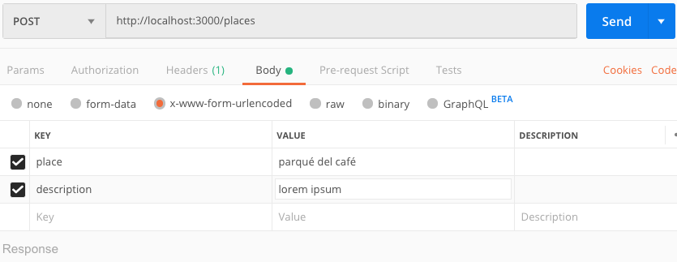
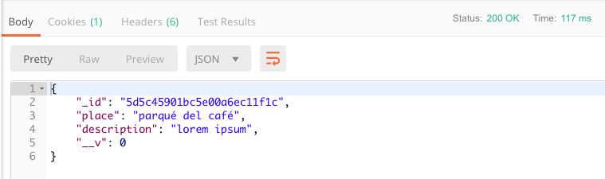
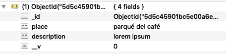

> ## Workshop 12:

<em>Crear nuestro primer modelo, ruta y registro</em>

Pasos:

1. creamos el archivo Place.js dentro del directorio models:
```
const mongoose = require('mongoose');

let Place = mongoose.Schema({
	place: {
		type: String,
		required: true
	},
	description: {
		type: String,
		required: true
	}
});

let Place = mongoose.model('Place');
```

2. Importamos el modelo en app.js
```
const Place = require('./models/Place');
```

3. Definimos el verbo HTTP POST dentro de app.js para habilitar la ruta de creación de lugares.
```
app.post('/places', (req, res) => {
	Place.create({
		place: req.body.place,
		description: req.body.description
	})
		.then(doc => {
			res.json(doc);
			console.log(doc);
		})
		.catch(err => {
			res.json(err);
			console.error(err);
		});
});
```

4. Probamos en Postman, ejecutando con POST la ruta:
```
http://localhost:3000/places
```

Además enviamos los parámetros place y description para realizar un registro, haciendo clic en "Send" para hacer la petición.



5. Verificamos que la petición sea correcta con status 200 y la salida de datos, con el id de generado por MongoDB.



6. Verificamos en la base de datos de MongoDB por medio de Robo 3T, que el registro efectivamente se haya realizado:



***

7. Definimos el verbo HTTP GET dentro de app.js para habilitar la ruta de listar lugares.

```
app.get('/places', (req, res) => {
	Place.find({})
		.then(doc => {
			res.json(doc);
			console.log(doc);
		})
		.catch(err => {
			res.json(err);
			console.error(err);
		});
});
```

8. Hacemos el respectivo proceso con Postman para verificar.

9. Guardamos los cambios en git.

***

<a href="../README.md">Regresar</a>