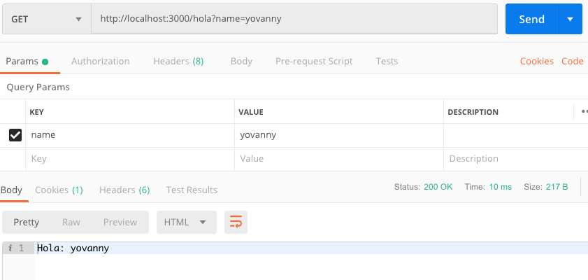

> ## Workshop 4:

<em>Recibir datos de una petición http</em>

Pasos:
1. Clonar el taller 3

2. Modificar el archivo server.js con el siguiente código:
```
const express = require('express');

const app = express();

app.get('/', (req, res) => {
    res.send('Running express');
});

app.get('/hello', function(req, res){
    res.send(`Hello: ${req.query.name}`);
});

app.listen(3000);
console.log('Server running at http://localhost:3000/');
```

3. En la terminal ejecutar el comando:
```
node server.js
```

4. Podemos verificar en el navegador el funcionamiento de la petición, con la url de ejemplo
```
http://localhost:3000/hello?name=yovanny
```

5. Ejecutar en Postman la petición de tipo GET con la url:
```
http://localhost:3000/hello?name=yovanny
```

* click en el botón Send:



* Debemos asegurarnos que el retorno sea status 200

***

<a href="../README.md">Regresar</a>
