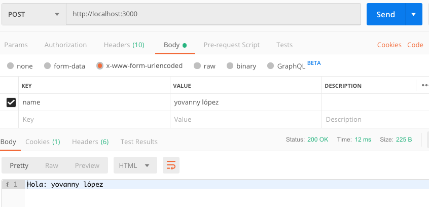

> ## Workshop 5:

<em>Enviar datos con POST</em>

Pasos:
1. Clonar el taller 4
2. Instalar la dependencia body parser
4. Modificar el archivo server.js con el siguiente código:
```
const express = require('express');
const bodyParser = require('body-parser');

const app = express();

app.use(bodyParser.urlencoded({ extended: true }));

app.get('/hello', function(req, res) {
	res.send(`Hello: ${req.query.name}`);
});

app.post('/', function(req, res) {
	res.send(`Hello: ${req.query.name}`);
});

app.listen(3000);
console.log('Server running at http://localhost:3000/');

```
5. Ejecutar en Postman la petición de tipo POST con la url:
```
http://localhost:3000/
```

* En body seleccionar x-wwww urlencoded, escribir el parámetro a enviar y click en el botón Send:



* Debemos asegurarnos que el retorno sea status 200

